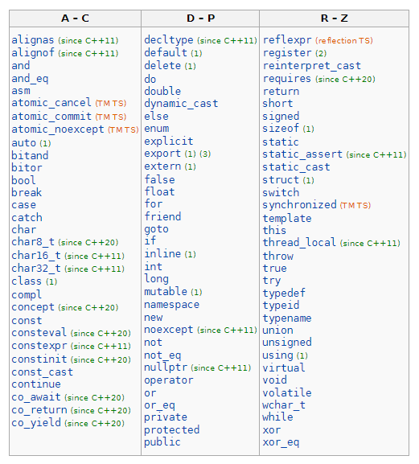
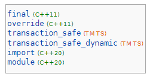
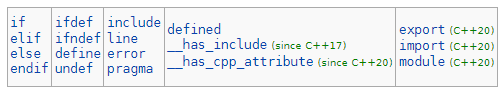

# A estrutura de um programa
## Visão Geral
A estrutura básica de um programa em C++ é:
- [Declaração](#declaração)
- [Funções e a função _main_](#a-função-main)
- [Componentes básicos](#componentes-básicos)
- [Diretivas do préprocessador](#diretivas-do-préprocessador)
- [Comentários](#comentários)
- [_Namespaces_](#namespaces)
- [_I/O_ Básico](#io-básico)

# Sobre a estrutura de um programa C++
## Declaração
Um programa de computador é uma sequência de instruções que dizem ao computador o que fazer. Uma instrução é um tipo de instrução que faz com que o programa execute alguma ação.

As instruções são de longe o tipo mais comum de instrução em um programa C++. Isso ocorre porque eles são a menor unidade independente de computação na linguagem C++. A esse respeito, eles agem como as sentenças em linguagem natural. Quando queremos transmitir uma ideia a outra pessoa, normalmente escrevemos ou falamos em frases (não em palavras ou sílabas aleatórias). Em C++, quando queremos que nosso programa faça alguma coisa, normalmente escrevemos instruções.

A maioria (mas não todas) instruções em C++ terminam em ponto e vírgula. Se você vir uma linha que termina em ponto e vírgula, provavelmente é uma declaração.

Em uma linguagem de alto nível como C++, uma única instrução pode ser compilada em muitas instruções de linguagem de máquina.

Existem muitos tipos diferentes de instruções em C++:

- Declarações de declaração
- Declarações de salto
- Declarações de expressão
- Declarações compostas
- Declarações de seleção (condicionais)
- Instruções de iteração (loops)
- Blocos try

## Funções e a função _main_

A melhor maneira de aprender uma linguagem de programação é escrevendo programas. Normalmente, o primeiro programa que os iniciantes escrevem é um programa chamado "Hello World", que simplesmente imprime "Hello World" na tela do seu computador. Embora seja muito simples, contém todos os componentes fundamentais que os programas em C++ possuem.

Em C++, as instruções são normalmente agrupadas em unidades chamadas funções. Uma função é uma coleção de instruções que são executadas sequencialmente (em ordem, de cima para baixo). À medida que você aprende a escrever seus próprios programas, você será capaz de criar suas próprias funções e misturar e combinar declarações da maneira que quiser (mostraremos como em uma lição futura

```c++
#include <iostream>
int main()
{
  std::cout << "Hello World!";
}
```
Logo todo programa em C++ deve conter uma função global chamada ```main```, que é o início designado do programa no ambiente hospedado. Quando o programa é executado, as instruções dentro de main são executadas em ordem sequencial. Deverá ter uma das seguintes formas:
```int main () { body }```
```int main (int argc, char *argv[]) { body }```
Onde
- ```argc``` é um valor não negativo que representa o número de argumentos passados para o programa do ambiente no qual o programa é executado.
- ```argv``` é o Ponteiro para o primeiro elemento de um array de ponteiros ```argc + 1```, dos quais o último é nulo e os anteriores, se houver, apontam para strings multibyte terminadas em nulo que representam os argumentos passados para o programa do ambiente de execução. Se ```argv[0]``` não for um ponteiro nulo (ou, equivalentemente, se ```argc > 0```), ele aponta para uma string que representa o nome usado para invocar o programa ou para uma string vazia.
- ```body``` é o corpo da função principal.

Os programas normalmente terminam (finalizam a execução) quando a última instrução dentro da função main é executada (embora os programas possam abortar mais cedo em algumas circunstâncias, ou fazer alguma limpeza depois).

As funções geralmente são escritas para fazer um trabalho específico. Por exemplo, uma função chamada “max” pode conter instruções que descobrem qual dos dois números é maior. Uma função chamada “calcularNotas” pode calcular a nota de um aluno a partir de um conjunto de pontuações de teste. Falaremos muito mais sobre funções em breve, pois elas são a ferramenta de organização mais usada em um programa.

```c++
#include <iostream>

int main()
{
   std::cout << "Hello world!";
   return 0;
}
```
A linha 1 é um tipo especial de linha chamada diretiva de pré-processador. Essa diretiva de pré-processador indica que gostaríamos de usar o conteúdo da biblioteca ```iostream```, que é a parte da biblioteca padrão C++ que nos permite ler e escrever texto de/para o console. Precisamos dessa linha para usar ```std::cout``` na linha 5. Excluir essa linha resultaria em um erro de compilação na linha 5, pois o compilador não saberia o que é ```std::cout```.

A linha 2 está em branco e é ignorada pelo compilador. Esta linha existe apenas para ajudar a tornar o programa mais legível para humanos (separando a diretiva #include do pré-processador e as partes subsequentes do programa).

A linha 3 diz ao compilador que vamos escrever (definir) uma função chamada ```main```. Como você aprendeu acima, todo programa C++ deve ter uma função principal ou não será possível vincular.

As linhas 4 e 7 informam ao compilador quais linhas fazem parte da função principal. Tudo entre a chave de abertura na linha 4 e a chave de fechamento na linha 7 é considerado parte da função principal. Isso é chamado de corpo da função.

A linha 5 é a primeira instrução dentro da função main e é a primeira instrução que será executada quando executarmos nosso programa. ```std::cout``` (que significa “saída de caracteres”) e o operador ```<<``` nos permitem enviar letras ou números para o console para serem gerados. Nesse caso, estamos enviando o texto “Hello world!”, que será enviado para o console. Essa instrução cria a saída visível do programa.

A linha 6 é uma instrução de retorno. Quando um programa executável termina de ser executado, o programa envia um valor de volta ao sistema operacional para indicar se foi executado com êxito ou não. Essa instrução de retorno específica retorna o valor 0 para o sistema operacional, o que significa “tudo correu bem!”. Esta é a última instrução no programa que é executada.

***

## Componentes básicos

### Palavras chaves e identificadores
A maioria das linguagens de programação possui palavras chaves. Palavras chaves fazem parte do vocabulario de uma linguagem de programação e na maioria das vezes são palavras reservadas, ou seja, o programador não pode redefinir seu significado e também não pode usar de outra forma que não seja a pretendida. Abaixo está uma lista com as palavras chaves no c++



No geral quanto mais palavras chaves uma linguagem possui, maic complexa ela se torna.

E acompanhado temos os identificadores que é algo que o programador nomeia, e as vezes criados por outros programadores para representar algo. 

No c++ temos alguns identificadores especiais que podem ser usados como nomes porém em certos contextos tem um significado.



E por fim também temos palavras que são reconhecidas pelo preprocessador quando usadas no contexto de uma diretiva do preprocessador.



```c++
#include <iostream>

int main()
{
  int numero_favorito;
  
  std::cout << "Digite seu numero favorito entre 1 e 100: ";
  std::cin >> numero_favorito;
  
  std::cout << "Incrivel!! Essse é meu número favorito também!" << std::endl;

  return 0;
}
```

Dado o exemplo anterior,

como palavra-chaves reservadas temos:
```c++
int return
```

como identificadores especiais temos:
```c++
include
```

e como identificadores normais temos:
```c++
numero_favorito std cout cin endl
```

### Operadores
O c++ possui muitos operadores. São eles

#### Operador de atribuição (```=```)
O operador de atribuição atribui um valor a uma variável

Operador | Descrição | Exemplo
--- | --- | --- |
```=``` | atribuição | ```x = 1;```

#### Operadores aritmeticos (```+, -, *, /, %```)
As operações de adição, subtração, multiplicação e divisão correspondem literalmente aos seus respectivos operadores matemáticos. O último, operador módulo, representado por um sinal de porcentagem (%), dá o resto de uma divisão de dois valores

Operador | Descrição | Exemplo
--- | --- | --- |
```+``` | Adição | ```x = 1 + 2;```
```-``` | Subtração | ```x = 1 - 2;```
```*``` | Multiplicação | ```x = 1 * 2;```
```/``` | Divisão | ```x = 4 / 2;```
```%``` | Módulo | ```x = 10 % 8;```

#### Atribuição composta (```+=, -=, *=, /=, %=, >>=, <<=, &=, ^=, |=```)
Os operadores de atribuição compostos modificam o valor atual de uma variável executando uma operação nela. Eles são equivalentes a atribuir o resultado de uma operação ao primeiro operando.


Expressão	| Equivalente à...
--- | ---
```y += x;```	| ```y = y + x;```
```x -= 5;```	| ```x = x - 5;```
```x /= y;```	| ```x = x / y;```
```preco *= unidades + 1;```	| ```preco = preco * (unidades+1);```

#### Incremento e decremento (```++, --```)
Algumas expressões podem ser ainda mais reduzidas: o operador de aumento (```++```) e o operador de diminuição (```--```) aumentam ou reduzem em um o valor armazenado em uma variável. Eles são equivalentes ```a +=1``` e ```a -=1```, respectivamente.

Expressão	| Equivalente à...
--- | ---
```x++;```	| ```x = x + 1;```
```x--;```	| ```x = x - 1;```

>Uma peculiaridade desse operador é que ele pode ser usado tanto como prefixo quanto como sufixo. Isso significa que pode ser escrito antes do nome da variável (```++x```) ou depois (```x++```).

Exemplo 1	| Exemplo 2
--- | ---
```x = 3;``` | ```x = 3;```
```y = ++x;``` | ```y = x++;```
```// x contem 4, y contem 4``` | ```// x contem 4, y contem 3```

#### Operadores relacionais e de comparação (```==, !=, >, <, >=, <=```)
Duas expressões podem ser comparadas usando operadores relacionais e de igualdade. Por exemplo, para saber se dois valores são iguais ou se um é maior que o outro. O resultado de tal operação é verdadeiro ou falso (ou seja, um valor booleano).


Operador	| Descrição | Exemplo
--- | --- | ---
```==```	| Igual a | ```(7 == 5)``` // É falso
```!=```	| Diferente de | ```(3 != 2)``` // É verdadeiro
```<```	| Menor que | ```(5 < 5)``` // É falso
```\>```	| Maior que | ```(5 > 4)``` // É verdadeiro
```<=```	| Menor ou igual que | ```(6 <= 7)``` // É verdadeiro
```\>=```	| Maior ou igual que | ```(6 >= 6)``` // É verdadeiro

#### Operadores lógicos (```!, &&, ||```)
O operador ```!``` é o operador C++ para a operação booleana NOT. Ele tem apenas um operando, à sua direita, e o inverte, produzindo ```false``` se seu operando for verdadeiro, e ```true``` se seu operando for falso. Basicamente, ele retorna o valor booleano oposto da avaliação de seu operando.

Operador | Descrição | Exemplo
--- | --- | --- |
```!``` | Não | ```!true;```
```\|\|``` | Ou | ```true \|\| false```
```&&``` | E | ```true && true;```

```c++
!(5 == 5) // É falso porque a expressão a direita (5 == 5) é verdadeira
!(6 <= 4) // É verdadeira porque a expressão (6 <= 4) é falsa
!true // É falsa
!false // É verdadeira
```

Os operadores lógicos ```&&``` e ```||``` são usados ao avaliar duas expressões para obter um único resultado relacional. O operador ```&&``` corresponde à operação lógica booleana _AND_, que produz ```true``` se ambos os operandos forem ```true``` e ```false``` caso contrário.


a	| b |	a && b
--- | --- | ---
```true``` |	```true``` |	```true```
```true``` |	```false``` |	```false```
```false``` |	```true``` |	```false```
```false``` |	```false``` |	```false```

O operador ```||``` corresponde à operação lógica booleana _OR_, que produz true se algum de seus operandos for``` true```, sendo ```false``` somente quando ambos os operandos forem ```false```.

a	| b |	a \|\| b
--- | --- | ---
```true``` |	```true``` |	```true```
```true``` |	```false``` |	```true```
```false``` |	```true``` |	```true```
```false``` |	```false``` |	```false```

#### Operador de vírgula (```,```)
O operador de vírgula (```,```) é usado para separar duas ou mais expressões incluídas onde apenas uma expressão é esperada. Quando o conjunto de expressões precisa ser avaliado para um valor, apenas a expressão mais à direita é considerada.
```c++
a = (b=3, b+2);
```
Primeiro atribuiria o valor 3 a b e, em seguida, atribuiria b+2 à variável a. Assim, no final, a variável a conteria o valor 5 enquanto a variável b conteria o valor 3.

#### Operadores bit a bit (```&, |, ^, ~, <<, >>```)
Os operadores bit a bit modificam as variáveis considerando os padrões de bits que representam os valores que eles armazenam.


Operador	| asm equivalente |	Descrição
--- | --- | ---
```&```	| AND |	Bitwise AND
```\|``` |	OR |	Bitwise inclusive OR
```^``` |	XOR |	Bitwise exclusive OR
```~```	| NOT |	Unary complement (bit inversion)
```<<``` |	SHL |	Shift bits left
```\>\>``` |	SHR |	Shift bits right

#### Size of (```sizeof```)
Este operador aceita um parâmetro, que pode ser um tipo ou uma variável, e retorna o tamanho em bytes desse tipo ou objeto.

```c++
x = sizeof (char);
```
Aqui, x recebe o valor 1, porque char é um tipo com tamanho de um byte.
O valor retornado por ```sizeof``` é uma constante de tempo de compilação, portanto, sempre é determinado antes da execução do programa.

***

## Diretivas do préprocessador 

As diretivas do pré-processador são linhas incluídas no código dos programas precedidas por um sinal de cerquilha (```#```). Essas linhas não são instruções de programa, mas diretivas para o pré-processador. O pré-processador examina o código antes que a compilação real do código comece e resolve todas essas diretivas antes que qualquer código seja realmente gerado por instruções regulares.

Essas diretivas de pré-processador se estendem apenas por uma única linha de código. Assim que um caractere de nova linha é encontrado, a diretiva do pré-processador termina. Nenhum ponto e vírgula (```;```) é esperado no final de uma diretiva de pré-processador. A única maneira pela qual uma diretiva de pré-processador pode se estender por mais de uma linha é precedendo o caractere de nova linha no final da linha por uma barra invertida (\).

Elas são usadas pra gerar códicos condicionalmente. Como exemplo diferentes plataformas podem possir maneiras distintas de se chegar a um resultado via código.

### Definições de macro (```#define, #undef```)
Para definir macros de pré-processador podemos usar ```#define```. Sua sintaxe é:

```#define <substituição pelo identificador>```

Quando o pré-processador encontra essa diretiva, ele substitui qualquer ocorrência de identificador no restante do código por substituição. Essa substituição pode ser uma expressão, uma instrução, um bloco ou simplesmente qualquer coisa. O pré-processador não entende C++ propriamente dito, ele simplesmente substitui qualquer ocorrência de identificador por substituição.
```
#define TABLE_SIZE 100
int table1[TABLE_SIZE];
int table2[TABLE_SIZE];
```
Depois que o pré-processador substituiu TABLE_SIZE, o código se torna equivalente a:
```
int table1[100];
int table2[100]; 
```
```#define``` pode trabalhar também com parâmetros para definir macros de função.
```
#define getmax(a,b) a>b?a:b 
```
Isso substituiria qualquer ocorrência de getmax seguida por dois argumentos pela expressão de substituição, mas também substituiria cada argumento por seu identificador, exatamente como você esperaria se fosse uma função.
```c++
// function macro
#include <iostream>
using namespace std;

#define getmax(a,b) ((a)>(b)?(a):(b))

int main()
{
  int x=5, y;
  y= getmax(x,2);
  cout << y << endl;
  cout << getmax(7,x) << endl;
  return 0;
}
```
As macros definidas não são afetadas pela estrutura do bloco. Uma macro dura até ser indefinida com a diretiva de pré-processador ```#undef```.
```c++
#define TABLE_SIZE 100
int table1[TABLE_SIZE];
#undef TABLE_SIZE
#define TABLE_SIZE 200
int table2[TABLE_SIZE];
```
Isso geraria o mesmo código que
```c++
int table1[100];
int table2[200];
```

### Inclusões condicionais (```#ifdef, #ifndef, #if, #endif, #else e #elif```)
Essas diretivas permitem incluir ou descartar parte do código de um programa se uma determinada condição for atendida.

```#ifdef``` permite que uma seção de um programa seja compilada apenas se a macro especificada como parâmetro tiver sido definida, não importa qual seja seu valor.
```c++
#ifdef TABLE_SIZE
int table[TABLE_SIZE];
#endif 
```
Neste caso, a linha de código ```int table[TABLE_SIZE];``` só é compilado se ```TABLE_SIZE``` foi previamente definido com ```#define```, independentemente de seu valor. Se não foi definida, essa linha não será incluída na compilação do programa.

```#ifndef``` serve exatamente para o oposto: o código entre as diretivas ```#ifndef``` e ```#endif``` só é compilado se o identificador especificado não tiver sido definido anteriormente.
```c++
#ifndef TABLE_SIZE
#define TABLE_SIZE 100
#endif
int table[TABLE_SIZE];
```
Neste caso, se ao chegar neste trecho de código, a macro ```TABLE_SIZE``` ainda não foi definida, ela seria definida com o valor ```100```. Se já existisse, manteria seu valor anterior, pois a diretiva ```#define``` não seria executado.

As diretivas ```#if```, ```#else``` e ```#elif``` (ou seja, "```else if```") servem para especificar alguma condição a ser atendida para que a parte do código que elas cercam seja compilada. A condição que segue ```#if``` ou ```#elif``` só pode avaliar expressões constantes, incluindo expressões de macro.
```c++
#if TABLE_SIZE>200
#undef TABLE_SIZE
#define TABLE_SIZE 200
 
#elif TABLE_SIZE<50
#undef TABLE_SIZE
#define TABLE_SIZE 50
 
#else
#undef TABLE_SIZE
#define TABLE_SIZE 100
#endif
 
int table[TABLE_SIZE]; 
```
Observe como toda a estrutura das diretivas encadeadas ```#if```, ```#elif``` e #else termina com ```#endif```.

O comportamento de ```#ifdef``` e #ifndef também pode ser obtido usando os operadores especiais definidos e !definidos respectivamente em qualquer diretiva ```#if``` ou ```#elif```:
```c++
#if defined ARRAY_SIZE
#define TABLE_SIZE ARRAY_SIZE
#elif !defined BUFFER_SIZE
#define TABLE_SIZE 128
#else
#define TABLE_SIZE BUFFER_SIZE
#endif 
```

### Controle de linha (```#line```)
Quando compilamos um programa e ocorre algum erro durante o processo de compilação, o compilador mostra uma mensagem de erro com referências ao nome do arquivo onde ocorreu o erro e um número de linha, assim fica mais fácil encontrar o código que gerou o erro.

A diretiva ```#line``` nos permite controlar as duas coisas, os números de linha dentro dos arquivos de código, bem como o nome do arquivo que queremos que apareça quando ocorrer um erro. Seu formato é:

```c++
#line numero "nome_do_arquivo"
```

Onde numero é o novo número de linha que será atribuído à próxima linha de código. Os números de linhas de linhas sucessivas serão aumentados um a um a partir deste ponto.

```"nome_do_arquivo"``` é um parâmetro opcional que permite redefinir o nome do arquivo que será mostrado.
```c++
#line 20 "assigning variable"
int a?;
```
Este código irá gerar um erro que será mostrado como erro no arquivo "atribuindo variável", linha 20.

### Diretiva de erro (```#error```)
Esta diretiva aborta o processo de compilação quando encontrada, gerando um erro de compilação que pode ser especificado como seu parâmetro.
```c++
#ifndef __cplusplus
#error A C++ compiler is required!
#endif 
```
Este exemplo interrompe o processo de compilação se o nome da macro ```__cplusplus``` não estiver definido (esse nome da macro é definido por padrão em todos os compiladores C++).

### Inclusão do arquivo de origem (```#include```)
Esta diretiva foi usada assiduamente em outras seções deste tutorial. Quando o pré-processador encontra uma diretiva ```#include```, ele a substitui por todo o conteúdo do cabeçalho ou arquivo especificado. Existem duas maneiras de usar ```#include```.
```c++
#include <header>
#include "file" 
```
No primeiro caso, um cabeçalho é especificado entre colchetes ```<>```. Isso é usado para incluir cabeçalhos fornecidos pela implementação, como os cabeçalhos que compõem a biblioteca padrão (```iostream```, ```string```,...). Se os cabeçalhos são realmente arquivos ou existem de alguma outra forma é definido pela implementação, mas em qualquer caso eles devem ser incluídos adequadamente nesta diretiva.

A sintaxe usada no segundo #include usa aspas e inclui um arquivo. O arquivo é pesquisado de maneira definida pela implementação, que geralmente inclui o caminho atual. Caso o arquivo não seja encontrado, o compilador interpreta a diretiva como uma inclusão de cabeçalho, como se as aspas (```""```) fossem substituídas por colchetes (```<>```).

### Diretiva pragma (```#pragma```)
Esta diretiva é usada para especificar diversas opções ao compilador. Essas opções são específicas para a plataforma e o compilador que você usa. Consulte o manual ou a referência do seu compilador para mais informações sobre os possíveis parâmetros que você pode definir com ```#pragma```.

Se o compilador não suportar um argumento específico para ```#pragma```, ele será ignorado - nenhum erro de sintaxe será gerado.

***

## Comentários 

Os comentários servem como uma espécie de documentação em código. Quando inseridos em um programa, eles são efetivamente ignorados pelo compilador; eles destinam-se exclusivamente a serem usados como notas pelas pessoas que lêem o código-fonte. Embora a documentação específica não faça parte do padrão C++, existem vários utilitários que analisam comentários com diferentes formatos de documentação.

Sintaxe | Descrição
--- | ---
```/* comment */``` | Muitas vezes conhecido como comentários "estilo C" ou "multi-linha"
```// comment``` | Frequentemente conhecido como comentários "estilo C++" ou "linha única".

Todos os comentários são removidos do programa na fase de tradução 3, substituindo cada comentário por um único caractere de espaço em branco.

```c++
#include <iostream>
/* C-style comments can contain
multiple lines */
/* or just one */
 
/**************
 *  you can insert any *, but
 *  you can't make comments nested
 */
 
// C++-style comments can comment one line
 
// or, they can
// be strung together
 
int main()
{
  // comments are removed before preprocessing,
  // so ABC is "1", not "1//2134", and "1 hello world"
  // will be printed
#define ABC 1//2134
  std::cout << ABC << " hello world\n";
 
  // The below code won't be run
  // return 1;
 
  // The below code will be run
  return 0;
}
```

***

## _Namespaces_ 

Os namespaces fornecem um método para evitar conflitos de nomes em projetos grandes. Os símbolos declarados dentro de um bloco de namespace são colocados em um escopo nomeado que evita que sejam confundidos com símbolos com nomes idênticos em outros escopos. Vários blocos de namespace com o mesmo nome são permitidos. Todas as declarações dentro desses blocos são declaradas no escopo nomeado.
```c++
namespace Q {
    namespace V {   // V is a member of Q, and is fully defined within Q
// namespace Q::V { // C++17 alternative to the above two lines
        class C { void m(); }; // C is a member of V and is fully defined within V
                               // C::m is only declared
        void f(); // f is a member of V, but is only declared here
    }
 
    void V::f() // definition of V's member f outside of V
                // f's enclosing namespaces are still the global namespace, Q, and Q::V
    {
        extern void h(); // This declares ::Q::V::h
    }
 
    void V::C::m() // definition of V::C::m outside of the namespace (and the class body)
                   // enclosing namespaces are the global namespace, Q, and Q::V
    {}
}
```
Se você já viu código C++ antes, pode ter visto ```cout``` sendo usado em vez de ```std::cout```. Ambos nomeiam o mesmo objeto: o primeiro usa seu nome não qualificado (```cout```), enquanto o segundo o qualifica diretamente dentro do ```namespace std``` (como ```std::cout```).

```cout``` faz parte da biblioteca padrão, e todos os elementos da biblioteca C++ padrão são declarados dentro do que é chamado de namespace: o ```namespace std```.

Para se referir aos elementos no namespace std, um programa deve qualificar todo e qualquer uso de elementos da biblioteca (como fizemos ao prefixar cout com ```std::```), ou introduzir visibilidade de seus componentes. A maneira mais típica de introduzir visibilidade desses componentes é por meio do uso de declarações:

```c++
using namespace std;
```

A declaração acima permite que todos os elementos no namespace std sejam acessados de maneira não qualificada (sem o prefixo ```std::```).

Com isso em mente, o último exemplo pode ser reescrito para fazer usos não qualificados de cout como:
```c++
#include <iostream>
using namespace std;

int main ()
{
  cout << "Hello World! ";
  cout << "I'm a C++ program";
}
```

***

## _I/O_ Básico 

Os programas de exemplo anteriores forneceram pouca interação com o usuário, se é que houve alguma. Eles simplesmente imprimiam valores simples na tela, mas a biblioteca padrão oferece muitas maneiras adicionais de interagir com o usuário por meio de seus recursos de entrada/saída. Esta seção apresentará uma breve introdução a alguns dos mais úteis.

C++ usa uma abstração conveniente chamada streams para realizar operações de entrada e saída em mídia sequencial, como a tela, o teclado ou um arquivo. Um fluxo é uma entidade onde um programa pode inserir ou extrair caracteres de/para. Não há necessidade de conhecer detalhes sobre a mídia associada ao stream ou qualquer de suas especificações internas. Tudo o que precisamos saber é que os fluxos são uma origem/destino de caracteres e que esses caracteres são fornecidos/aceitos sequencialmente (ou seja, um após o outro).

A biblioteca padrão define um punhado de objetos de fluxo que podem ser usados ​​para acessar o que são considerados as origens e destinos padrão de caracteres pelo ambiente em que o programa é executado:


Fluxo | Descrição
--- | ---
```cin```	| Fluxo de entrada padrão
```cout``` | Fluxo de saída padrão
```cerr``` | Fluxo padrão de saída de erro
```clog``` | Fluxo padrão de saída de log

E com isso temos os operadores de inserção e extração:

Operador | Descrição | Exemplo
--- | --- | ---
```<<```	| Inserção para fluxo de saída | ```cout << "Hello World";```
```>>``` | Extração para fluxo de entrada | ```cin << valor;```

### Saída padrão (```cout```)
Na maioria dos ambientes de programa, a saída padrão por padrão é a tela e o objeto de fluxo C++ definido para acessá-lo é cout.
Para operações de saída formatadas, ```cout``` é usado junto com o operador de inserção, que é escrito como ```<<``` (ou seja, dois sinais de "menor que").
```c++
cout << "Output sentence"; // prints Output sentence on screen
cout << 120;               // prints number 120 on screen
cout << x;                 // prints the value of x on screen
```
O operador ```<<``` insere os dados que o seguem no fluxo que o precede. Nos exemplos acima, ele inseriu a string literal Output sentença, o número 120 e o valor da variável x no fluxo de saída padrão ```cout```. Observe que a frase na primeira declaração está entre aspas duplas (") porque é uma string literal, enquanto na última, x não é. As aspas duplas são o que faz a diferença; quando o texto é colocado entre elas, o texto é impresso literalmente; quando não são, o texto é interpretado como o identificador de uma variável e seu valor é impresso em seu lugar.

Várias operações de inserção (<<) podem ser encadeadas em uma única instrução:
```c++
cout << "This " << " is a " << "single C++ statement";
```
### Entrada padrão (```cin```)
Na maioria dos ambientes de programa, a entrada padrão por padrão é o teclado e o objeto de fluxo C++ definido para acessá-lo é ```cin```.

Para operações de entrada formatadas, ```cin``` é usado junto com o operador de extração, que é escrito como ```>>``` (ou seja, dois sinais "maior que"). Este operador é então seguido pela variável onde os dados extraídos são armazenados. Por exemplo:
```c++
int age;
cin >> age;
```
A primeira declaração declara uma variável do tipo ```int``` chamada ```age```, e a segunda extrai de ```cin``` um valor para ser armazenado nela. Esta operação faz com que o programa espere pela entrada de ```cin;``` geralmente, isso significa que o programa aguardará que o usuário digite alguma sequência com o teclado. Neste caso, observe que os caracteres introduzidos pelo teclado só são transmitidos ao programa quando a tecla ENTER (ou RETURN) é pressionada. Uma vez que a instrução com a operação de extração em cin é alcançada, o programa aguardará o tempo necessário até que alguma entrada seja introduzida.

A operação de extração em ```cin``` usa o tipo da variável após o operador ```>>``` para determinar como ela interpreta os caracteres lidos da entrada; se for um inteiro, o formato esperado é uma série de dígitos, se uma string uma sequência de caracteres, etc.

Extrações em cin também podem ser encadeadas para solicitar mais de um dado em uma única instrução:
```c++
cin >> a >> b;
```
Isso é equivalente a:
```c++
cin >> a;
cin >> b;
```


# Fontes:

- https://en.cppreference.com/w/cpp/language/main_function
- https://www.cplusplus.com/doc/tutorial/operators/
- https://www.cplusplus.com/doc/tutorial/preprocessor/
- https://en.cppreference.com/w/cpp/comment
- https://en.cppreference.com/w/cpp/language/namespace
- https://www.cplusplus.com/doc/tutorial/basic_io/
- https://www.learncpp.com/cpp-tutorial/statements-and-the-structure-of-a-program/