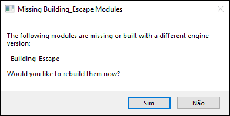
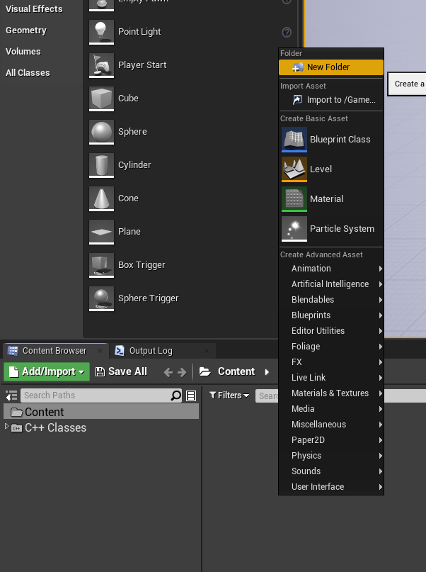
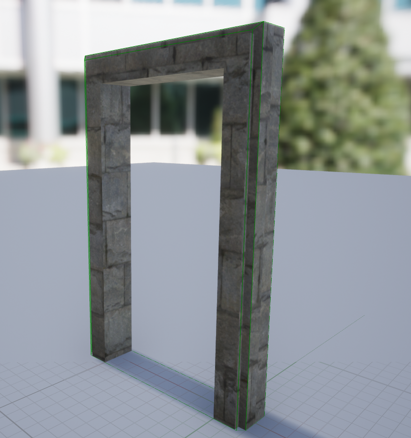

# Estudo sobre Unreal Engine

## Sobre
Unreal Engine é um motor de jogo desenvolvido pela Epic Games, usado pela primeira vez em 1998 no jogo de tiro em primeira pessoa Unreal, ele tem sido a base de muitos jogos desde então. Embora usado inicialmente para jogos de tiro em primeira pessoa, ele tem sido usado com sucesso em uma grande variedade de gêneros de jogos.

Seu núcleo é escrito em C++, possibilitando a portabilidade. Suporta múltiplas plataformas, incluindo Microsoft Windows, Linux, Mac OS e Mac OS X em computadores pessoais, e os consoles Dreamcast, GameCube, Nintendo Switch, PlayStation 2, PlayStation 3, PlayStation 4, PlayStation 5, Stadia, Wii, Wii U, Xbox, Xbox 360, Xbox One e Xbox Series X.

## Referencias
- [Textures.com](https://www.textures.com/library) - Site pra obter texturas

## Instalação

## Unreal Engine
### Padronização
- Variáveis em CamelCase. Ex.: ```int UmaVariavel = 10;```
- Variáveis booleanas começam com b. Ex.: ```bool bGameOver = false;```

### Códigos úteis
#### Angulo atual de um objeto dado x e y
```c++
float X = GetOwner()->GetActorForwardVector().X;
float Y = GetOwner()->GetActorForwardVector().Y;
float Hip = FMath::Sqrt(FMath::Pow(X, 2) + FMath::Pow(Y, 2));
float Sin = Y / Hip;
float Degree = FMath::RadiansToDegrees( FMath::Asin(Sin) );
if (Sin < 0)
{
  Degree = 180.f + (FMath::Abs(Degree));
}
```

### Controlando a ViewPort
Pode se ter mais de um viewport. É bem útil quando se esta trabalhando em mais de um Level. Para ativar outras pode se ir em **Window** > **ViewPorts**.

<div align='center'>
  
</div>

### Actor e Components
- Um Actor é um container que pode ter muitos Components
- Existem muitos tipos diferentes de Components

### Adicionando cabeçalho de Copyright
É possível adicionar cabeçalhos automaticos de Copyright aos seus arquivos criados.
Para isso deve se ir em **Edit** > **Project Settings**.

<div align='center'>
  
</div>

Depois em **Project** > **Description** e colocar a mensagem de copyright em **Copyright Notice**

<div align='center'>
  
</div>

### Unreal C++ Types
O Unreal tem seus próprios tipos.
<div align='center'>
  <table>
    <thead>
      <tr>
        <th>Tipo C++</th>
        <th>Tipo Unreal</th>
      </tr>
    <thead>
    <tbody>
      <tr><td>std::string</td><td>FString</td></tr>
      <tr><td>int</td><td>int32</td></tr>
      <tr><td>char</td><td>TCHAR</td></tr>
      <tr><td>[]</td><td>TArray< type ></td></tr>
    <tbody>
  </table>
</div>

#### FString
No geral, deve se usar o macro ```TEXT()``` quando for usar variaveis em string. Se não for especificado, o padrão de codificação de caractere será o ANSI, no qual é muito limitado em relação ao suporte de caracteres. Qualquer literal ANSI passado para um FString deve ser convertido pra TCHAR (codificação unicode nativa), então é mais eficiente usar ```TEXT()```.
```c++
FString Frase = TEXT("O rato roeu a roupa do rei de Roma");
```
##### Formatando corretamente
Podemos usar a função ```Printf``` para formatar valores e adiciona-los em uma string.
```c++
int quantidade = 10;
FString::Printf(TEXT("Eu tenho %i maças"), quantidade); // Eu tenho 10 maças

FString palavra = TEXT("Mundo");
FString::Printf(TEXT("Olá %s"), *palavra); // Olá mundo

FString::Printf(TEXT("Olá %s, eu tenho %i maças"), *palavra, quantidade); // Olá mundo, eu tenho 10 maças
```
- ```Len()``` Retorna a quantidade de caracteres na string.

#### TCHAR
```c++
const TCHAR HW[] = TEXT("BOLOS");
```

#### TArray
- ```Num()``` Retorna a quantidade de elementos do array.
- ```Add()``` Adiciona um elemento no final do array.
- ```Emplace()``` Adiciona um elemento no final do array.
- ```Remove()``` Remove elementos.

```c++
const TArray<FString> Palavras = {
  TEXT("VERMELHO"),
  TEXT("VERDE"),
  TEXT("AZUL")
};
```

### Unreal C++ Classes e metodos
#### FMath
```FMath::RandRange(0, 10)``` Retorna um número aleatorio que seja 0 ou 10, ou entre 0 e 10.

### Alguns metodos pra ajudar
#### Carregando dados a partir de um arquivo
Em vez de aumentar massivamente os tempos de execução criando conteudo pode se mudar isso carregando dados diretamente de arquivos com o metodo ```FFileHelper::LoadFileToStringArray```. O exemplo a seguir carrega uma lista de palavras em um array.
```c++
TArray<FString> Palavras;
const FString WordListPath = FPaths::ProjectContentDir() / TEXT("WordLists/HiddenWordList.txt");
FFileHelper::LoadFileToStringArray(Palavras, *WordListPath);
```
##### Carregando dados com um criterio
Podemos usar o metodo anterior pra popular um array baseado em um criterio, apenas usando C++ e lambdas. ```LoadFileToStringArrayWithPredicate``` pode obter um argumento adicional na forma de função que recebe uma string e retorna um booleano. O exemplo a seguir adiciona ao array somente palavras que tenham menos de 10 caracteres dado o arquivo contendo os dados.
```c++
TArray<FString> Palavras;
const FString WordListPath = FPaths::ProjectContentDir() / TEXT("WordLists/HiddenWordList.txt");
FFileHelper::LoadFileToStringArrayWithPredicate(Palavras, *WordListPath, [](const FString& Word) { return Word.Len() < 10; });
```


##### Packaging
Para que isso funcione em um jogo empacotado, você precisaria adicionar o diretório WordLists à lista de Diretórios Não-Ativos Adicionais para empacotar em suas Configurações do Projeto em Empacotamento. Alternativamente, você pode simplesmente usar a pesquisa.
<div align='center'>
  
</div>

### Classes e componentes
Após adicionar um objeto na cena, podemos selecionar ele, e depois ir em **+Add Component** > **New C++ Component**.

<div align='center'>
  
</div>

Selecione **Actor Component** e depois clique em **Next**. Finalmente coloque o nome da classe clique em **Create Class**.

<div align='center'>
  
</div>

Nesse exemplo será utilizado **Teste** como nome da classe.
Com isso teremos os seguintes arquivos criados:
> Teste.h
```c++
// Fill out your copyright notice in the Description page of Project Settings.

#pragma once

#include "CoreMinimal.h"
#include "Components/ActorComponent.h"
#include "Teste.generated.h"


UCLASS( ClassGroup=(Custom), meta=(BlueprintSpawnableComponent) )
class BUILDING_ESCAPE_API UTeste : public UActorComponent
{
	GENERATED_BODY()

public:
	// Sets default values for this component's properties
	UTeste();

protected:
	// Called when the game starts
	virtual void BeginPlay() override;

public:
	// Called every frame
	virtual void TickComponent(float DeltaTime, ELevelTick TickType, FActorComponentTickFunction* ThisTickFunction) override;


};
```
É importante ressaltar que a linha de include da sua propria classe ```SuaClasse.generate.h``` deve sempre ficar abaixo das inclusões das classes do Unreal.
```c++
...
#include "CoreMinimal.h"
#include "Components/ActorComponent.h"
#include "Teste.generated.h" // Sempre abaixo
...
```

> Teste.cpp
```c++
// Fill out your copyright notice in the Description page of Project Settings.


#include "Teste.h"

// Sets default values for this component's properties
UTeste::UTeste()
{
	// Set this component to be initialized when the game starts, and to be ticked every frame.  You can turn these features
	// off to improve performance if you don't need them.
	PrimaryComponentTick.bCanEverTick = true;

	// ...
}


// Called when the game starts
void UTeste::BeginPlay()
{
	Super::BeginPlay();

	// ...

}


// Called every frame
void UTeste::TickComponent(float DeltaTime, ELevelTick TickType, FActorComponentTickFunction* ThisTickFunction)
{
	Super::TickComponent(DeltaTime, TickType, ThisTickFunction);

	// ...
}


```
O método ```BeginPlay()``` é chamado sempre que o jogo começa.

O método ```TickComponent()``` é chamado a cada quadro do jogo.

No método construtor, a instrução ```PrimaryComponentTick.bCanEverTick = true;``` indica que o método ```TickComponent``` sempre será chamado a cada quadro. É possível desativar atribuindo como ```false```.

### Deletando uma classe
É preciso navegar até onde o projeto está localizado e excluir os arquivos manualmente. Eles ficam em ```.../raiz_do_projeto/Source/NomeDoProjeto/```

Depois é necessário apagar o diretorio **Binaries** que fica em ```.../raiz_do_projeto/Binaries```. Lembre-se de fechar o UnrealEngine antes.

Abra o UnrealEngine novamente e você devera ver a seguinte mensagem, no qual devera clicar em sim, depois de abrir seu projeto:

<div align='center'>
  
</div>

### Mensagens de Log
Podemos gerar mensagens de log em tempo de execução utilizando as classes de log do Unreal, através de:
```c++
UE_LOG(Categoria, Verbosidade, Mensagem)
```
No qual:
- Category: Onde o log será gerado, podendo ser ```LogTemp``` (Log temporário)
- Verbosity: Tipo de log, podendo ser ```Warning```(Amarelo), ```Error```(Vermelho), ```Display```(Cinza).
- Mensagem: A mensagem a ser descrita no log.
Exemplo:
```c++
UE_LOG(LogTempo, Warning, TEXT("Uma mensagem de LOG"));
```

### Acessando o nome de um objeto
```c++
#include "GameFramework/Actor.h" // include necessário

void UYourClass::BeginPlay()
{
  FString ObjectName = GetOwner()->GetName();
}
```

### Acessando localização e transformação do objeto
```c++
#include "GameFramework/Actor.h" // include necessário

void UYourClass::BeginPlay()
{
  FString ObjectPosition = GetOwner()->GetActorLocation().ToString(); // Localização

  FString ObjectTranform = GetOwner()->GetActorTransform().ToString(); // Transformação
  FString AnotherObjectPosition = GetOwner()->GetActorTransform().GetLocation().ToString(); // Localização
}
```

### Organização
Quando se cria um novo projeto, após salvar a cena, crie uma pasta em **Content** chamada **Levels** e mova a cena pra ela.

<div align='center'>
  
</div>

<div align='center'>
  
</div>

### Importando Meshes Personalizados
Para adicionar meshes a sua cena, no Content Browser, clique em **Import** > **Import To**. Então selecione os arquivos para serem adicionados, e depois de clicar em **Open** irá aparecer o menu de importação do FBX. Se ainda não for trabalhar com as colisões do Mesh, é bom deixar marcado a opção **Generate Missing Collisions**:

<div align='center'>
  
</div>

### Criando um material
Para criar um material rapidamente, basta arrastar uma textura para o mesh e então será criado um novo material.

### Corrigindo problemas de textura em um Material
Para abrir o editor de Material, podemos dar dois cliques em um Material, e vamos para a seguinte janela de programação visual do Material:

<div align='center'>
  
</div>

Então deletamos a textura associada:

<div align='center'>
  
</div>

E adicionamos outra clicando em **Base Color** arrastando para o lado, no qual abrira uma caixa de busca, e por fim digitamos **Texture** e escolhemos **TextureSample**.

<div align='center'>
  
</div>

Finalmente selecionamos a textura desejada e aplicamos ao nosso Material.

<div align='center'>
  
</div>

Podemos também adicionar novas texturas aos Meshs somente arrastando elas da area **Contents** e puxando para o Mesh.

**É recomendado que se crie novas instancias de um material ao invés de aplicar texturas diretamente ou adicionar ao Mesh, porque assim conseguimos editar unicamente mesh com mesmo material e aplicar diferentes resultados de acordo com cada instancia do material. Para isso clique no material e escolha Create Material Instance**

<div align='center'>
  
</div>

### Atribuindo um material padrão ao mesh
Podemos adicionar um material padrão a um mesh e toda vez que criarmos aquele mesh na cena, ele ja vai estar com o material. Para isso deve dar dois cliques no mesh, e então escolher o material desejado:

<div align='center'>
  
</div>

### Redimensionando texturas
#### Expondo parametros do mesh para o editor
Clicado duas vezes no material, e depois criado um componente através de **UVs**. O nome do componente é **TextureCoordinate**.

<div align='center'>
  
</div>

Depois clicamos na area e inserimos outro componente, o **ScalarParameter**. E então o renomeamos para TextureScale, e em seguida definimos seu **Default Value** em 1.0.

<div align='center'>
  
</div>

Em seguida criamos outro componente chamado **Multiply**.

<div align='center'>
  
</div>

E finalmente realizamos as seguintes conexões: Saída de **Multiply** em **Texture Sample**; Saída de **TexCoord** em **Multiply**; e Saída de **Texture Scale** em **Multiply**.

<div align='center'>
  
</div>

Com isso cada instancia do material ganha a seguinte propriedade:

<div align='center'>
  
</div>

Através do componente **AppendVector** conseguimos controlar a escala da textura em X e Y:

<div align='center'>
  
</div>

### Rotacionando um ator
Podemos rotacionalo através do seguinte método:
```c++
GetOwner()->SetActorRotation(CurrentRotation);
```
Obs.: Ao pegar a rotação de um ator, se ela chegar ou ultrapassar 180°, será retornado um valor negativo. Para contornar isso, pode ser normalizar esse rotação da seguinte forma:
```c++
FRotator CurrentRotation = GetOwner()->GetActorRotation();
if (CurrentRotation.Yaw < 0) {
  CurrentRotation.Yaw = 180.f + FMath::Abs(CurrentRotation.Yaw + 180.f);
}
```

Existem alguns métodos de interpolação que podemos usar para aplicar o efeito de abrir a porta:
```c++
...
float CurrentYaw = FMath::FInterpConstantTo(CurrentRotation.Yaw, 90, DeltaTime, 45.0F); // Interpolação Linear - DEPENDE DO TEMPO E NÃO DA TAXA DE QUADORS
float CurrentYaw = FMath::FInterpTo(CurrentRotation.Yaw, this->TargetCloseYaw, DeltaTime, 2.0F); // Interpolação Exponencial - DEPENDE DO TEMPO E NÃO DA TAXA DE QUADORS
float CurrentYaw = FMath::Lerp(CurrentRotation.Yaw, this->TargetCloseYaw, 0.01f); // DEPENDE DA TAXA DE QUADROS
...
```

Neste exemplo será usado o mesh de uma porta. Primeiro é necessário definir o tipo de mobilidade do objeto como **Movable**:

<div align='center'>
  
</div>

Em seguida adicionamos o componente **OpenDoor** a este ator.

>Opendoor.h
```c++
public:
  ...
  void OpenDoor(float DeltaTime);
	void CloseDoor(float DeltaTime);
	FRotator GetActorRotation();
  ...

private:
  ...
  bool DoorOpened = false;
	bool DoorClosed = false;
	bool DoorAction = false;
	float InitialYaw = 0.0f;
	float TargetCloseYaw = 0.0f;
  float TargetOpenYaw = 90.f;
	float CurrentYaw = 0.0;
  ...
};
```

> OpenDoor.cpp
```c++

...
#include "Math/UnrealMathUtility.h"
...

void UOpenDoor::BeginPlay()
{
	...
	Super::BeginPlay();

  FRotator CurrentRotation = GetActorRotationYaw(0);
	this->InitialYaw = CurrentRotation.Yaw;
	this->CurrentYaw = this->InitialYaw;
	this->TargetCloseYaw = this->InitialYaw;
	this->TargetOpenYaw += this->InitialYaw;
	this->DoorOpened = false;
	this->DoorClosed = true;
	this->DoorAction = false;
  ...
}

...
void UOpenDoor::TickComponent(float DeltaTime, ELevelTick TickType, FActorComponentTickFunction* ThisTickFunction)
{
	Super::TickComponent(DeltaTime, TickType, ThisTickFunction);

	if (!this->DoorAction && !this->DoorOpened)
	{
		this->OpenDoor(DeltaTime);
	}
	if (!this->DoorAction && !this->DoorClosed)
	{
		this->CloseDoor(DeltaTime);
	}
}

void UOpenDoor::OpenDoor(float DeltaTime)
{
	FRotator CurrentRotation = GetActorRotationYaw(CurrentYaw);
	CurrentYaw = FMath::FInterpConstantTo(CurrentYaw, TargetOpenYaw, DeltaTime, 45.0F);
	CurrentRotation.Yaw = CurrentYaw;

	if (CurrentRotation.Yaw >= TargetOpenYaw) {
		this->DoorClosed = false;
		this->DoorOpened = true;
		this->DoorAction = false;
	}

	GetOwner()->SetActorRotation(CurrentRotation);
}

void UOpenDoor::CloseDoor(float DeltaTime)
{
	FRotator CurrentRotation = GetActorRotationYaw(CurrentYaw);
	CurrentYaw = FMath::FInterpConstantTo(CurrentYaw, TargetCloseYaw, DeltaTime, 45.0F);
	CurrentRotation.Yaw = CurrentYaw;

	if (CurrentRotation.Yaw <= TargetCloseYaw) {
		this->DoorClosed = true;
		this->DoorOpened = false;
		this->DoorAction = false;
	}

	GetOwner()->SetActorRotation(CurrentRotation);
}

FRotator UOpenDoor::GetActorRotationYaw(float LastYaw)
{
	FRotator CurrentRotation = GetOwner()->GetActorRotation();
	if (CurrentRotation.Yaw < 0) {
		CurrentRotation.Yaw = 180.f + FMath::Abs(CurrentRotation.Yaw + 180.f);
	}
	return CurrentRotation;
}

float UOpenDoor::NormalizeAngle(float Angle)
{
	return (float)((int)Angle % 360);
}
...
```

### Colisão de objetos
Existem algumas formas de trabalharmos com colisão:

Usar colisão complexa, no qual é criado um colisor a partir dos dados reais da geometria. Isso é muito caro em termos de processamento porque conforme suas cenas ficam maiores, podemos esquecer que fizemos isso e acabamos criando mais, deixando talvez o processamento do jogo bem lento.

Usar o BSP e converter o objeto para um mesh estatico e posicionalo onde se deseja trabalhar com a colisão deixando tudo bem simples. Caso o modelo seja relaticamente simples pode se criar a colisão a partir de um modelo primitivo mesmo.

Usar as colisões vindas do proprio artista do mesh.

Para abordar os dois primeiros tipos vamos clicar duas vezes do mesh para ter acesso a ferramenta de edição dele no qual poderemos trabalhar com colisões no mesmo.

<div align='center'>
  
</div>

Se clicarmos em **Collision** e depois em **Simple Collision**:

<div align='center'>
  
</div>

Poderemos ver uma caixa em verde ao redor do nosso modelo, porém se não tivermos a colisão no nosso modelo vinda de quem fez o modelo, não há nada dentro porque as formas convexas são as mais dificeis de calcular em termos de fisica. Portanto uma colisão simples será assim, colocando uma caixa delimitadora ao redor fazendo com que as partes convexas não possam ser atravessadas.

<div align='center'>
  
</div>

Se escolhermos a **Complex Collision** já conseguimos observar que ela consegue delimitar a partes convexas do modelo, e com isso tendo muito mais geometria na colisão podendo assim compromoter o desempenho do jogo.

<div align='center'>
  
</div>

Para fins de teste, a melhor maneira seria marcar o tipo de colisão como **Complex Collision**, e depois na esquerda escolher a opção **Use Complex Collision as Simple**.

<div align='center'>
  
</div>

### Expondo parametros do código para o editor
Para expor parametros do código e editarmos no editor, colocamos o seguinte marcador acima dos atributos:
```c++
UPROPERTY(EditAnywhere)
float TargetOpenYaw;
```
E depois de compilarmos, conseguimos edita-lo selecionando o componente e então logo abaixo podemos ver nosso atributo.

<div align='center'>
  
</div>

### Convenção para nomear os recursos

<div align='center'>
  
</div>

#### Diretorio de recursos
##### Mapas

| | |
--- | ---
Content\Maps | parent maps folder
............ Maps\Episode(_Number) | game episodes, where (_Number) is 01, 02, 03, etc
............ Maps\TestMaps | test maps, maps prototypes and other levels not for production

##### Recursos

| | |
--- | ---
Content\Base | basic materials, material functions and other “foundation” assets
Content\Characters | folder for characters
............ Characters\NPC | NPCs
............ Characters\Player | player character(s)
Content\Dev | development assets, like objects icons, special meshes and textures, etc
Content\Effects | various shared effects
Content\Environment | environment assets
............ Environment\Background | backgrounds
............ Environment\Buildings | buildings (simple or procedural)
............ Environment\Foliage | foliage
............ Environment\Props | various props
............ Environment\Sky | skies
............ Environment\Landscape | terrains assets
............ Environment\Water | water meshes and materials
Content\Gameplay | assets for various gameplay purposes
Content\PostProcess | post process chains and it’s assets
Content\Sound | sounds and sound cues
Content\UI | UI assets
Content\Vehicles | vehicles with effects
Content\Weapons | weapons with effects

#### Diretorios por Categoria

| | |
--- | ---
Blueprints | blueprints
Meshes | static and skeletal meshes, physical assets
Materials | materials and instances
Textures | textures
Animations | animations
Particles | particle systems
LensFlares | flares
Sounds | sounds + cues
Morphs | morphs
FaceFX | FaceFX assets

#### Nomeação dos recursos
Form: (Prefixo_)NomeRecurso(_Numero)(_Sufixo)

Example: T_Rock_01_D

##### Prefixos
Por uso:

| | |
--- | ---
CH_ | Characters
UI_ | User Interface
VH_ | Vehicles
WP_ | Weapons

Por tipo:

| | | | |
--- | --- | --- | ---
BP_ | Blueprint | SK_ | Skeletal Mesh
SM_ | Static Mesh | AD_ | Apex Destructible Asset
AC_ | Apex Cloth Asset | MT_ | Morph Target
ST_ | Speed Tree | PS_ | Particle System
LF_ | Lens Flare | VF_ | Vector Field
S_ | Sound | SC_ | Sound Cue
M_ | Material | MI_ | Material Instance
MITV_ | Material Instance Time Varying | MF_ | Material Function
MPC_ | Material Parameter Collection | T_ | Texture
SP_ | Sprite | SS_ | Sprite Sheet
TC_ | Texture Cube | RT_ | Render Target
PM_ | Physical Material

##### Sufixos
Textura:

| | | | |
--- | --- | --- | ---
_BC | Base color | _MT | Metallic
_S | Specular | _R | Roughness
_N | Normal | _DP | Displacement
_AO | Ambient Occlusion | _H | Height Map
_FM | Flow Map | _L | Light Map (fake)
_M | Mask

Meshs:

| | |
--- | ---
_Physics | physics assets (generated name)
_FaceFX | FaceFx assets

Animações:

| | |
--- | ---
_BlendSpace | blend space (generated name)
_AnimBlueprint | animation blueprint (generated name)

### Trigger Volumes
Um Trigger Volume possibilita adicionar ações em determinadas situações. Podemos associar a um listener que espera algo ativar (como passar por uma area) para executar algo.

Podemos acessa-los atraves do painel esquerdo em **Place Actors** > **Basic**.

<div align='center'>
  
</div>

Ou simplesmente digitando **Trigger** na caixa de busca

<div align='center'>
  
</div>

Podemos criar apenas arrastando para nossa cena. Uma muita muito importante de se fazer é sempre renomear com o nome apropriado, como um ID.

<div align='center'>
  
</div>

Para vincular ao nosso codigo e possivelmente expormos como parametro no editor precisamos incluir seu header e depois cria-lo no nosso header.
```c++
...
#include "Engine/TriggerVolume.h"
...

...
UPROPERTY(EditAnywhere)
ATriggerVolume* PressurePlate;
...
```

Finalmente associamos nosso trigger a porta

<div align='center'>
  
</div>

#### Usando colisão nos volumes
Existem dois tipos:
- Polling no qual é checado toda vez se algo aconteceu.
- Por evento no qual somos notificados quando algo aconteceu.

##### Polling
Para se fazer dessa forma, precisamos escolher o ator que ira acionar o evento e faremos isso expondo o parametro para o editor
```c++
UPROPERTY(EditAnywhere)
ATriggerVolume* PressurePlate;

UPROPERTY(EditAnywhere)
AActor* ActorThatOpen;
```

E então podemos adicionar a seguinte lógica para verificarmos se o ator esta acionando o trigger:
```c++
if (PressurePlate && PressurePlate->IsOverlappingActor(ActorThatOpen))
{
  ...
}
```

Obs.: Durante o teste é necessário escolher o ator que vai acionar o trigger:

<div align='center'>
  
</div>
