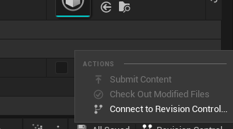

# Unreal Engine

## Como inicializar e configurar o git no seu projeto (Windows e Unreal 5.2)

Você vai precisar dos seguintes recursos para baixar e instalar:

- [GitHub Desktop](https://desktop.github.com/)
- [Git](https://gitforwindows.org/)
- [Git Large File Storage](https://git-lfs.com/)

Depois de instalar tudo, abra seu projeto Unreal e clique em `Revision Control`:

<div align='center'></div>

Então escolha a opção `Connect to Revision Control`:

<div align='center'></div>

E selecione a seguinte opção:
- Provider: `Git (beta version)`

E deixe marcado somente as seguintes opções:
- `Add a .gitignore file`
- `Add a basic README.md file`
- `Add a .gitattributes file to enable Git LFS`

Em seguida clique em `Initialize project with Git`.

<div align='center'></div>

Depois da aparecer uma mensagem indicando que tudo ocorreu com sucesso, clique em `Accept Settings`.

Agora abra o GitHub Desktop e vá em `File > Add local repository`. Na caixa que abriu, selecione o local do seu projeto Unreal que contem a pasta `.git`, e clique em `Add repository`.

<div align='center'></div>

Feito isso, na proxima caixa, clique em `Initialize Git LFS`.

<div align='center'></div>

Vá no diretorio do seu projeto  e abra o arquivo `.gitattributes`. Substitua tudo pelo seguinte conteúdo:

```
Content/** filter=lfs diff=lfs merge=lfs -text
*.uasset filter=lfs diff=lfs merge=lfs -text
```

Alterne para o Github Desktop e desmarque todos os arquivos deixando somente o `.gitattributes`.
<div align='center'></div>

Em seguida clique em `Commit to main`. E depois em `Publish repository`. Isso fará com que seja criado o repositorio remoto no no Github.

<div align='center'></div>

Agora marque todos os arquivos, insira a mensagem de commit e depois clique novamente em `Commit to main`.

<div align='center'></div>

Depois de feito isso é só clicar em `Push origin` para subir as alterações para o repositorio remoto. Pronto, seu repositorio esta criado e configurado.


## Usando o plugin Online Subsystem Steam (Unreal 5.2)

Quando usar o plugin multiplayer da steam, é necessário incluir as seguintes informações no arquivo `DefaultEngine.ini`:

```
[/Script/Engine.GameEngine]
+NetDriverDefinitions=(DefName="GameNetDriver",DriverClassName="OnlineSubsystemSteam.SteamNetDriver",DriverClassNameFallback="OnlineSubsystemUtils.IpNetDriver")

[OnlineSubsystem]
DefaultPlatformService=Steam

[OnlineSubsystemSteam]
bEnabled=true
SteamDevAppId=480
bInitServerOnClient=true

[/Script/OnlineSubsystemSteam.SteamNetDriver]
NetConnectionClassName="OnlineSubsystemSteam.SteamNetConnection"
```

E no arquivo `DefaultGame.ini` o seguinte conteúdo:

```
[/Script/Engine.GameSession]
MaxPlayers=100
```

## Quando for fazer Retarget de um modelo da Mixamo para outro modelo com root

Se não fizer isso, o root bone vai ser rotacionado errado. Para corrigir, no IK Retargeter, selecione `root` em `Target Chain` e define `Rotation Mode` como `None`. A partir disso é só exportar normalmente as animações.

<div align='center'></div>
